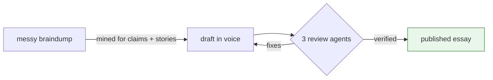

# figures

Every serious essay gets 1–3 figures. A good figure is often the reason a piece gets shared: it compresses ten sentences into one glance, and it signals the author cared enough to draw the thing. Julia Evans built a career partly on hand-drawn diagrams; Dan Luu's most-cited posts lead with a chart.

But a decorative figure is worse than none. Only draw when a picture genuinely beats the prose.

## when a figure earns its place

- **structure**: components and how they connect (block diagram)
- **flow**: a request, a pipeline, a lifecycle moving through stages (left-to-right flow diagram)
- **comparison**: before/after, old way/new way, side by side
- **a decision**: branching logic the prose would describe as nested ifs
- **scale or trend**: numbers over time or across options (simple bar/line, only with real data)

If the concept is a single linear sentence, prose wins. Never draw a figure to decorate a section that didn't need one.

## block diagram craft

1. **one idea per figure.** If the diagram needs a paragraph to explain, split it.
2. **seven boxes max.** Past that, group boxes into a labeled cluster or cut detail. The reader should parse it in under five seconds.
3. **label the arrows.** An unlabeled arrow is a vibe, not information. "sends webhook", "reads from", "falls back to".
4. **flow reads one direction.** Left→right for pipelines and time, top→down for hierarchy and decisions. Never both in one figure.
5. **the interesting part gets the visual weight.** The one box the essay is actually about is highlighted; everything else is context and stays plain.
6. **words in boxes are nouns, words on arrows are verbs.**
7. **caption every figure** with one lowercase line stating the takeaway, not a title: "the retry queue is the only stateful piece" beats "figure 2: architecture".

## format

Default to **Mermaid in a fenced code block** — it renders on GitHub and most blog platforms, diffs cleanly, and the author can edit it without a drawing tool:

Use standalone **SVG files** instead when the platform doesn't render Mermaid (X posts, some newsletters) or when precise layout matters. Keep SVGs self-contained (no external fonts), text at 14px+ so it survives phone screens, and save next to the essay as `figures/<slug>-<n>.svg`.

For X/Twitter specifically: figures must work as attached images at phone size... one bold idea, big text, minimal boxes.

Accessibility: give every figure alt text describing the relationship it shows ("diagram: three services writing to one queue"), not its appearance.

## charts with data

Only chart numbers that are real and cited, from the research pass. Label axes with units, start bar charts at zero, and put the headline finding in the caption. If the data came from the author's own measurement, say so in the essay body ("i ran this 50 times on an M3...") since that's exactly the lived-specificity the voice depends on.
